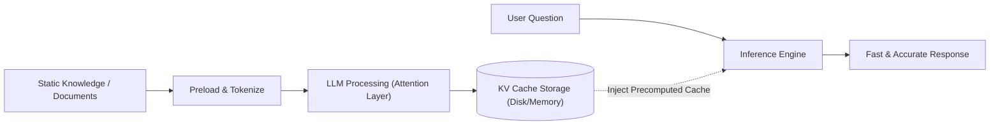

<div align="center">

# Optimizing LLMs with Cache-Augmented Generation (CAG)

**Efficiently retrieve knowledge and accelerate Large Language Model (LLM) inference using precomputed Key-Value (KV) caching.**

This project explores Cache-Augmented Generation (CAG) as an alternative to Retrieval-Augmented Generation (RAG). By leveraging expanded context windows and precomputed KV caches, CAG enables faster, low-latency, and more efficient performance for static, knowledge-intensive tasks.

[](https://python.org)
[](https://pytorch.org)
[](https://huggingface.co/docs/transformers)

</div>

---

## Overview

Modern Large Language Models (LLMs) can process massive amounts of tokens, reducing the need for traditional chunking and retrieval pipelines like RAG. However, recomputing key-value (KV) representations for the same external knowledge with every query is highly inefficient. 

**Cache-Augmented Generation (CAG)** solves this by precomputing the KV representations of your knowledge base once and reusing them across multiple queries. This dramatically reduces redundant computations, accelerating response times and simplifying the system architecture.

---

## Features

| Feature | Description |
|----------|-------------|
| **Precomputed KV Caching** | Compute and store Key-Value representations of knowledge once using `DynamicCache`. |
| **Low Latency Inference** | Bypass the need to re-encode the entire knowledge base for every user query. |
| **No Retrieval Pipeline** | Eliminates complex vector databases, chunking, and similarity search for static knowledge. |
| **Hugging Face Ecosystem** | Built using `transformers`, `torch`, and `sentence-transformers`. |
| **Performance Visualizations** | Includes tools to generate comparative graphs for inference time and similarity. |

---

## Architecture



---

## How CAG Works

1. **Preloading External Knowledge**: Select important documents and load them into the model's context.
2. **Precomputing Key-Value (KV) Cache**: Process the documents through the model once to generate and store the KV cache.
3. **Storing the KV Cache**: Save the processed cache to disk or keep it in memory for instant access.
4. **Inference**: When a query arrives, the model uses the stored KV cache, avoiding real-time reprocessing of the knowledge base.
5. **Cache Reset**: Easily flush or update the cache when the underlying knowledge base changes.

---

## Tech Stack

- **Language:** Python
- **Framework:** PyTorch
- **Core Strategy:** Cache-Augmented Generation (CAG)
- **Libraries:** Hugging Face Transformers, SentenceTransformers, Pandas, Matplotlib, scikit-learn
- **Environment:** Google Colab / Local Jupyter Notebook (Apple Silicon / MPS supported)

---

## Quick Start

### Prerequisites

- Python 3.10+
- PyTorch (CUDA or MPS enabled for Mac)
- A Hugging Face account and access token

### Installation

Clone the repository and install the dependencies:

```bash
git clone https://github.com/YOUR_USERNAME/cache-augmented-generation.git
cd cache-augmented-generation

pip install torch transformers sentence-transformers pandas matplotlib scikit-learn tqdm
```

### Environment Setup

Create a `.env` file in the root directory and add your Hugging Face token:

```ini
HF_TOKEN="your_hugging_face_token_here"
```

---

## Usage

You can implement CAG by importing the core `CAGModule` provided in the notebook.

```python
from transformers.cache_utils import DynamicCache
import torch

# Load the CAG Module (Example)
cag = CAGModule(model_name="your-chosen-llm", hf_token="your_hf_token")

# 1. Prepare and Save KV Cache
knowledge_base = "Your extensive document text goes here..."
kv_cache, prep_time = cag.prepare_kvcache(
    documents=knowledge_base, 
    kvcache_path="data_cache/knowledge.pt"
)

# 2. Run Inference using the Precomputed Cache
response = cag.run_qna(
    question="What is the main topic of the document?", 
    knowledge_cache=kv_cache
)

print(response)
```

---

## Visualizing Performance

The project includes a `helpers.py` script to benchmark and visualize model performance when using CAG. It plots:
- Average Similarity
- Average Inference Time (seconds)
- KV Cache Preparation Time (seconds)

```python
from helpers import generate_graphs
generate_graphs(qa_details, model_summary_stats)
```

---

## Concepts Covered

- Large Language Models (LLMs)
- Retrieval-Augmented Generation (RAG) vs. Cache-Augmented Generation (CAG)
- Key-Value (KV) Caching in Transformer Architectures
- Context Window Optimization
- Prompt Engineering for Precomputed Contexts

---

## Applications

- **Static Knowledge Bots:** Question answering on fixed company policies or manuals.
- **Fast Document Analysis:** Rapid querying over large, preloaded research papers.
- **Low-Latency Chatbots:** Systems requiring instant responses without the overhead of real-time retrieval steps.

---

## References

- [Cache-Augmented Generation (CAG) Paper - arXiv:2412.15605](https://arxiv.org/abs/2412.15605)
- [Hugging Face Transformers Documentation](https://huggingface.co/docs/transformers)
- IBM Cache-Augmented Generation (Granite) Datasets

---

## License

This project is intended for educational and research purposes.

---

<div align="center">
<sub>Built using Python, Hugging Face Transformers, PyTorch, and Cache-Augmented Generation techniques.</sub>
</div>
